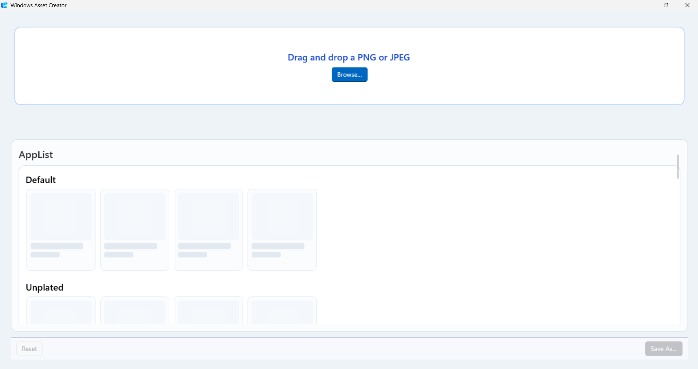
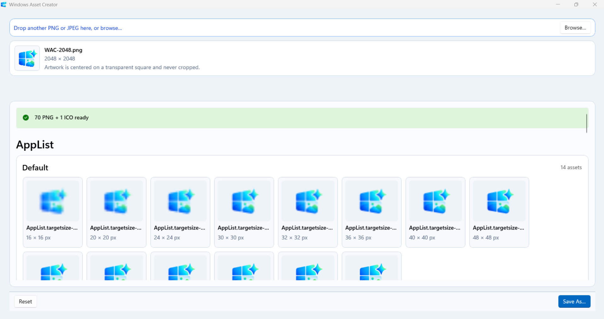
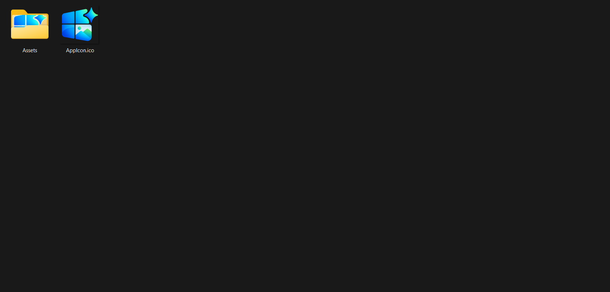
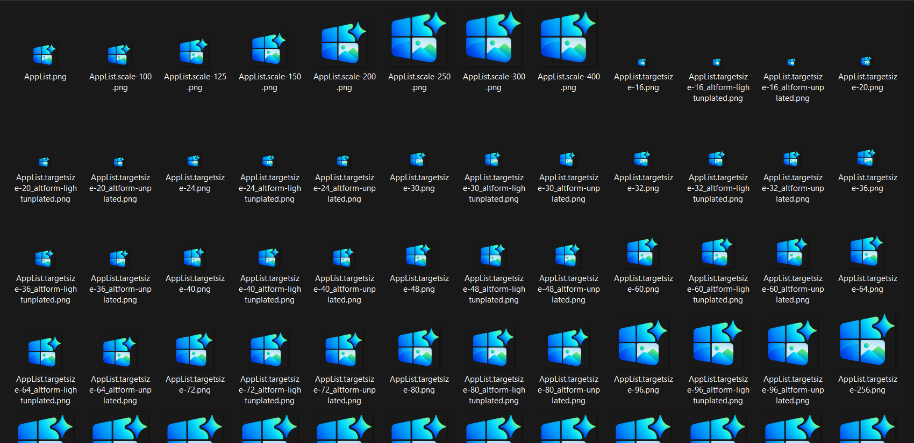

# Windows Asset Creator

Windows Asset Creator is a native Windows utility from **404 Builds** that turns one PNG or JPEG into a complete Microsoft Store / MSIX asset package.

Drop in a source image, review the generated asset board, and export a validated ZIP containing the Windows packaging assets your app needs.

## Screenshots

---

---

---


## What it generates

Windows Asset Creator currently produces:

- 70 PNG assets
- `AppIcon.ico`
- AppList target-size variants
- Unplated AppList variants
- Light-unplated AppList variants
- AppList base and scale variants
- Square 150 assets
- Store logo assets
- Medium tile assets
- Wide 310 × 150 logo

All generated output is validated before export.

## Workflow

1. Drag and drop a PNG or JPEG, or choose one with **Browse**.
2. Review the generated assets in the grouped asset board.
3. Select **Save As...** to export the complete package as a ZIP.

Non-square artwork is centered on a transparent square and is never cropped.

## Native Windows app

Windows Asset Creator is built with:

- C++20
- WinUI 3
- C++/WinRT
- Windows App SDK
- Windows Imaging Component (WIC)

There is no Python runtime, .NET runtime dependency, cloud processing, account system, or telemetry.

Image processing happens locally on your PC.

## Output

The exported ZIP contains:

```text
Assets/
  AppList.targetsize-*.png
  AppList.targetsize-*_altform-unplated.png
  AppList.targetsize-*_altform-lightunplated.png
  AppList.png
  AppList.scale-*.png
  Square150x150Logo.png
  Square150x150Logo.scale-*.png
  StoreLogo.png
  StoreLogo.scale-*.png
  MedTile.scale-*.png
  Wide310x150Logo.png

AppIcon.ico
```

## Project structure

```text
root/
├── src/        UI-independent C++ asset-generation core
├── windows/    WinUI 3 application
└── tests/      Native test suite
```

The Windows frontend owns file intake, presentation, Save As, and Explorer integration.

The core owns image decoding, normalization, resizing, PNG/ICO generation, validation, staging, and ZIP export.

## Build requirements

- Windows
- Visual Studio 2022 Build Tools or Visual Studio 2022
- MSBuild
- Desktop development with C++
- Windows SDK
- Windows App SDK / WinUI 3 build dependencies

## Build

From the repository root:

```powershell
msbuild .\root\WindowsAssetCreator.sln /m /restore `
  /p:RestorePackagesConfig=true `
  /p:Configuration=Debug /p:Platform=x64
```

## Test

Run the native test executable produced by the build:

```powershell
.\root\x64\Debug\AssetCoreTests.exe
```

The native test suite covers:

- Store/MSIX profile integrity
- image decode and resize behavior
- PNG and ICO generation
- staging and ZIP export
- validation
- board-state behavior

## Current input support

- PNG
- JPEG / JPG

Additional image formats are planned for a future release.

## Design goals

Windows Asset Creator is intentionally focused:

- one source image
- one Windows/MSIX profile
- no cropping by default
- local processing
- deterministic output
- visual review before export
- one Save As flow

It is an asset-generation utility, not an image editor.

## Publisher

Built by **404 Builds**.

**We build what's missing.**
